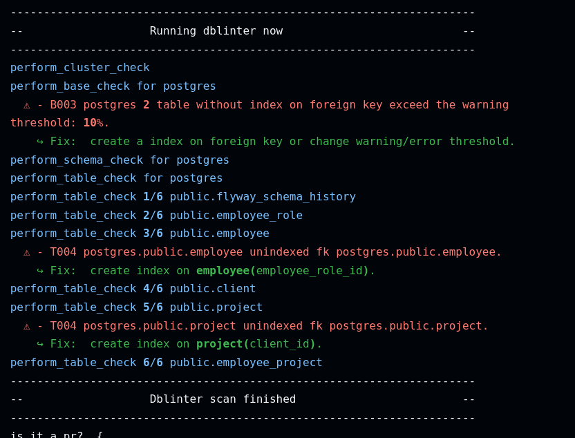

# dblinter

Static conformity is largely used in the dev world but there is no such tool for databases schemas.
This tool connect to a postgres database to check good practices in schema design and output a file in [Sarif][2] format.
A configuration file describe the rule to enforce and acceptable threshold

An example of the output is: 

## Launch dblinter

### Docker

You can use the docker image if you prefer not to install python on your computer.

Launch the docker image

```sh
docker run --rm -t decathlon/dblinter:latest  --dbname $PGDATABASE --host $PGHOST --user $PGUSER --password $PGPASSWORD --port $PGPORT
```

## Directly from the source

You can launch dblinter directly from the source code. You will need python and poetry to install the dependencies:

```shell
# Install poetry
curl -sSL https://install.python-poetry.org | python3 -
# Install dependencies
poetry install --with dev
# Launch the program
poetry run python -m dblinter --dbname $PGDATABASE --host $PGHOST --user $PGUSER --password $PGPASSWORD --port $PGPORT
```

## Usage

```shell

 Usage: python -m dblinter [OPTIONS]

╭─ Options ─────────────────────────────────────────────────────────────────────────────────────────────────────────────────────────╮
│ *  --user      -U      TEXT                                                 pg username [env var: PGUSER] [default: None]         │
│                                                                             [required]                                            │
│ *  --password  -W      TEXT                                                 pg pwd     [env var: PGPASSWORD] [default: None]      │
│                                                                             [required]                                            │
│ *  --host      -h      TEXT                                                 pg hostname [env var: PGHOST] [default: None]         │
│                                                                             [required]                                            │
│    --port      -p      TEXT                                                 pg port [env var: PGPORT] [default: 5432]             │
│ *  --dbname    -d      TEXT                                                 pg dbname  [env var: PGDATABASE] [default: None]      │
│                                                                             [required]                                            │
│    --sslmode   -s      [allow|prefer|require|verify-ca|verify-full|simple|  pg sslmode                 [env var: PGSSLMODE]       │
│                        disable]                                             [default: SslMode.disable]                            │
│    --describe  -b      TEXT                                                 describe is added in sarif invocation field           │
│                                                                             [default: None]                                       │
│    --filename  -f      TEXT                                                 rules configuration file                              │
│    --append    -a                                                           sarif report is append to output file [default: True] │
│    --output    -o      TEXT                                                 report output file [default: None]                    │
│    --loglevel  -l      [DEBUG|INFO|WARNING|ERROR|CRITICAL]                  log level [default: LogLevels.warning]                │
│    --schema    -n      TEXT                                                 tables in schema only filter                          │
│    --exclude   -x      TEXT                                                 Exclude table filter                                  │
│    --include   -i      TEXT                                                 Include table filter                                  │
│    --quiet     -q                                                           Quiet mode [env var:QUIET]                            │
│    --help                                                                   Show this message and exit.                           │
╰───────────────────────────────────────────────────────────────────────────────────────────────────────────────────────────────────╯

```

## Contributing

We welcome contributions from the community. For more details on contributing to the project (including requirements), please refer to "[Getting Started with Contributing](CONTRIBUTING.md)."

<!--
Links
-->
[2]: https://docs.oasis-open.org/sarif/sarif/v2.1.0/sarif-v2.1.0.html
